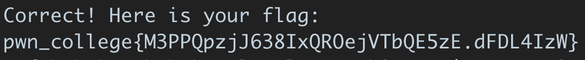

## Deadline: ~~Sep 17th, 11:59 PM PST~~ Sep 20th, 11:59 PM PST

In this assignment, you will play with the Linux ELF binaries.
The goal is to reverse the ELF binaries, understand what it requires from you, and answer the questions or pass the check.

There are two parts in this assignment: The x86-64 playground and
Babykey. We will combine the two parts together for your final score of this
assignment.

## x86-64 Playground

In this part, you need to connect to the playgound server and answer the questions.
The service domain is `asu-cse545.com`, and the port number is 3000.
You can connect by `nc asu-cse545.com 3000`.
You need to provide your ASURITE ID (e.g., tiffanyb) once connected so that we
can recognize your identity and grade your assignment.
The service will also tell you the current score once you log in with your
ASURITE.

**Headsup:** Challenge `shift`, `caesar`, and `fib`'s outputs depend on the format string of function `printf`.
Here are the format strings:

`shift` : "%d"
`caesar` : "%s"
`fib` : "%d"

## Babykey

In this part, you will reverse engineer the acutal Linux binaries in ELF format.
You will come across 15 + 3 (extra credit) challenges each of which has
different checks.
You need to send correct input to each challenge in order to pass the check.
If your input is correct, the binary will output a flag.
Once you get the flag, you will need to submit it to the website.
It will tell you if the flag is correct.

```
Correct! Here is your flag:
pwn_college{M3PPQpzjJ638IxQROejVTbQE5zE.dFDL4IzW}
```

<!---->

To start the Babykey game, you need to set up your account by the following steps:

1. Visit [http://asu-cse545.com](http://asu-cse545.com) and register an account.

   **Notice**: You can register anonymously now! We will identify you as long as
   your email address is associated with your ASURITE.

   **Notice**: We encourage you register anonymously since we will publish the
   scoreboard. If you already register, you can change your user name at [http://asu-cse545.com/settings](http://asu-cse545.com/settings).

1. You need to create an ssh key to access the challenge. Once you create an ssh
   key, copy paste your **public key** to [http://asu-cse545.com/settings#key](http://asu-cse545.com/settings#key). [This link](https://docs.github.com/en/github/authenticating-to-github/generating-a-new-ssh-key-and-adding-it-to-the-ssh-agent#generating-a-new-ssh-key) will instruct you how to generate an ssh key.

1. Go to Challenges ([http://asu-cse545.com/challenges](http://asu-cse545.com/challenges)), and you will see the Babykey challenges. There are 6 levels and 18 challenges in the game. You can click any of them and play with the binary.

1. To get your flag, make sure you connect to the server per the instruction of
   each challenge, connect to the server, and run the binary on the server with
   the correct input.

```
ctf@babykey_babykey_level1_teaching1:/$ ls
babykey_babykey_level1_teaching1  etc	lib32	mnt   run   tmp
bin				  flag	lib64	opt   sbin  usr
boot				  home	libx32	proc  srv   var
dev				  lib	media	root  sys
ctf@babykey_babykey_level1_teaching1:/$ ./babykey_babykey_level1_teaching1
====================
./babykey_babykey_level1_teaching1
... license verifier
====================
...
```

## Score Calculation

There are 5 challenges in x86-64 Playground and 18 challenges in Babykey.
The full score of this assignment is 100, and your score will be calculated as `5 * #(solved challenges)`.
You can get 115 in maximum.
We will convert this assignment's score to your final grade by multiplying it by 25%.

## Questions?

If you have any questions, please contact the CSE545 Staff via Slack
`#assignment2-questions`
